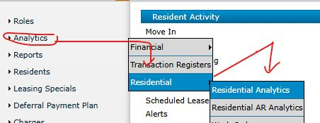
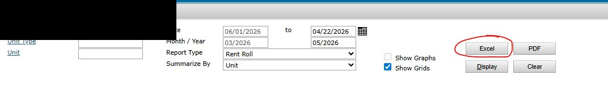
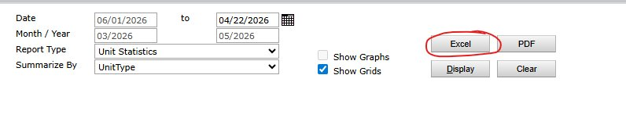
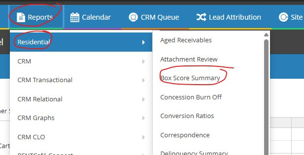
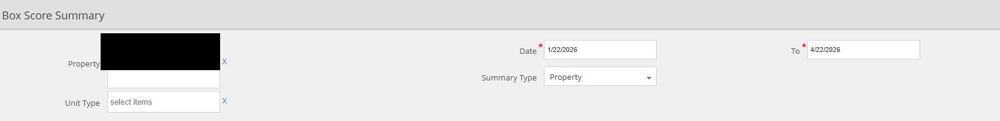
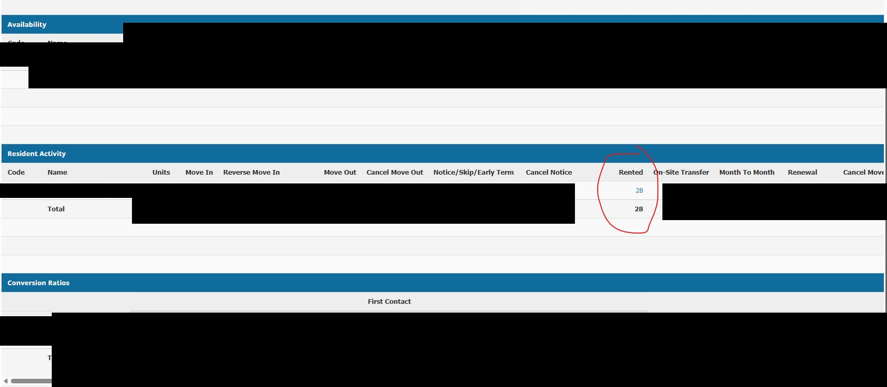
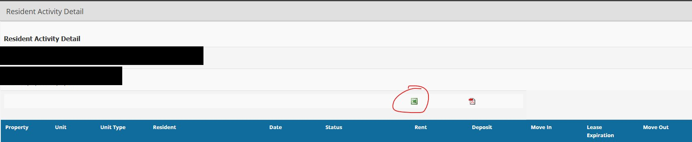
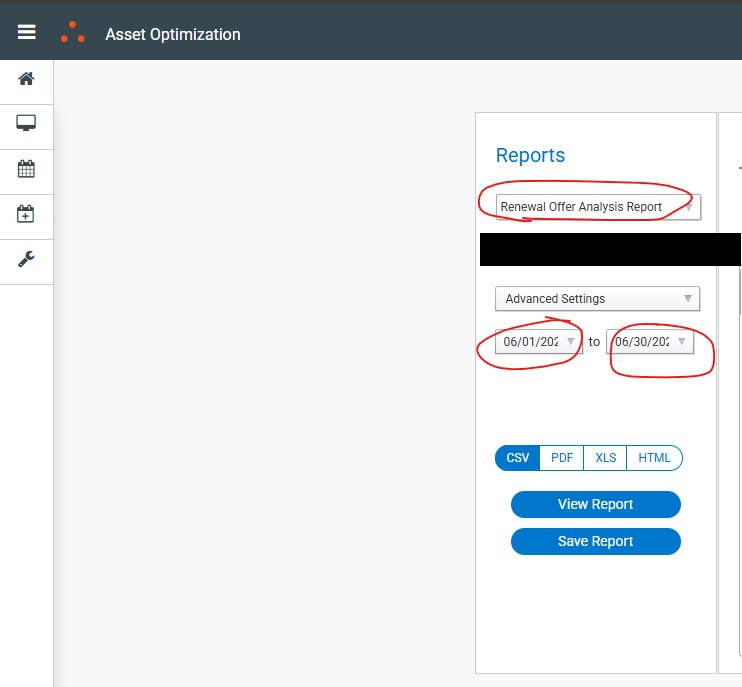
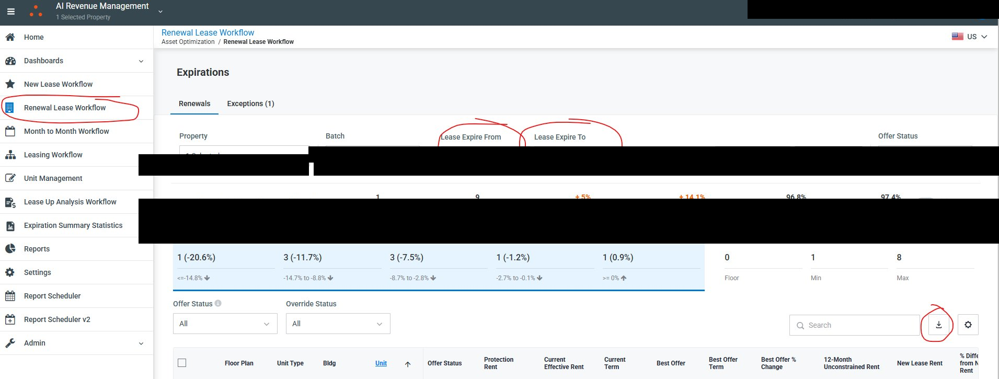

# Pulling Reports for the Renewal Workbook

**Systems covered:** Yardi Voyager 7S · Yardi CRM · RealPage · AIRM

This guide covers where to find and export each of the five source reports the workbook imports each month. For import instructions, see the main [README](README.md).

---

## Report 1: Rent Roll Report

**System:** Yardi Voyager 7S — Residential Analytics

### How to Navigate

1. From the left-hand menu, click **Analytics**
2. Hover over **Residential**
3. Select **Residential Analytics** from the flyout menu

> Navigation: Analytics → Residential → Residential Analytics

### Settings

| Field | Value |
|---|---|
| Property | Enter your property code |
| From | First day of the current month (may be greyed out — if so, leave it) |
| To | Today's date |
| Month / Year | Confirm this reflects the current accounting period |
| Report Type | Rent Roll |
| Summarize By | Unit |

Click the **Excel** button to download.

> ⚠️ The **From** date field may be greyed out on some properties — this is expected. Set the **To** date and proceed.  
> Always confirm the accounting period matches the current month before exporting.

---

## Report 2: Unit Statistics Report

**System:** Yardi Voyager 7S — Residential Analytics

### How to Navigate

Same path as the Rent Roll Report:

> Navigation: Analytics → Residential → Residential Analytics

### Settings

| Field | Value |
|---|---|
| Property | Enter your property code |
| From | First day of the current month (may be greyed out — if so, leave it) |
| To | Today's date |
| Month / Year | Confirm the current accounting period |
| Report Type | Unit Statistics |
| Summarize By | UnitType |

Click the **Excel** button to download.

> ⚠️ The **From** date field may be greyed out on some properties — this is expected. Set the **To** date and proceed.  
> Change only the **Report Type** and **Summarize By** fields from the Rent Roll settings above.

---

## Report 3: Resident Activity Detail Report

**System:** Yardi CRM — Box Score Summary

### Step 1: Navigate to Box Score Summary

1. Click **Reports** in the top navigation bar
2. Hover over **Residential** in the left menu
3. Select **Box Score Summary** from the list

> Navigation: Reports → Residential → Box Score Summary

### Step 2: Configure Settings

| Field | Value |
|---|---|
| Property | Select your property |
| From | 3 months ago from today |
| To | Today's date |
| Summary Type | Property |

Click **Display** to run the report.

> ⚠️ This report uses a 3-month lookback window. The **From** date must be exactly 3 months prior to today.

### Step 3: Click the Rented Number

1. Once the report loads, scroll to the **Resident Activity** section
2. Find the **Rented** column and click the blue hyperlinked number (e.g., 28)
3. This opens the **Resident Activity Detail** drill-down

### Step 4: Export to Excel

1. On the Resident Activity Detail page, confirm the property and date range are correct
2. Click the **green Excel icon** to download

> ⚠️ There are two export icons on this page — select the **green Excel icon**, not the red PDF icon.

---

## Report 4: Renewal Offer Analysis Report

**System:** RealPage — Asset Optimization → Reports

### How to Navigate

1. Log into RealPage and go to **Asset Optimization**
2. Click **Reports** in the left sidebar

### Settings

| Field | Value |
|---|---|
| Report | Renewal Offer Analysis Report |
| Property | Select your property |
| Date Range | Full month you are generating renewal offers for (e.g., 06/01/2026 to 06/30/2026) |
| Format | `.csv` |

Select **`.csv`** as the format, then click **View Report** or **Save Report** to download. The import wizard filters for `.csv` files — an `.xls` or `.xlsx` export will not appear in the file picker.

> ⚠️ Set the date range to the **month you are generating renewal offers for** — not the current month.

---

## Report 5: Unit Rents Grid Report

**System:** AIRM — Renewal Lease Workflow

### How to Navigate

1. Log into AIRM (AI Revenue Management)
2. Click **Renewal Lease Workflow** in the left navigation panel

### Settings

| Field | Value |
|---|---|
| Property | Confirm the correct property is selected |
| Lease Expire From | First day of the renewal offer month (e.g., 06/01/2026) |
| Lease Expire To | Last day of the renewal offer month (e.g., 06/30/2026) |

> ⚠️ Use the same month as the RealPage Renewal Offer Analysis Report (Report 4).

### Downloading the File

1. Once the expirations load, locate the **download icon** in the bottom-right area of the screen (arrow pointing down)
2. Click the download icon to export
3. The file downloads as the **Unit Rents Grid** in `.xlsx` format

---

## Summary

| # | Report | System | Format | Required? |
|---|---|---|---|---|
| 1 | Rent Roll | Yardi Voyager 7S | `.xlsx` | **Yes** |
| 2 | Unit Statistics | Yardi Voyager 7S | `.xlsx` | Recommended |
| 3 | Resident Activity Detail | Yardi CRM | `.xls` | Recommended |
| 4 | Renewal Offer Analysis | RealPage | `.csv` | Recommended |
| 5 | Unit Rents Grid | AIRM | `.xlsx` | Recommended |

Export all five reports for the same month before starting the import. The import wizard walks you through file selection one at a time — click **Cancel** on any file you don't have to skip it.
